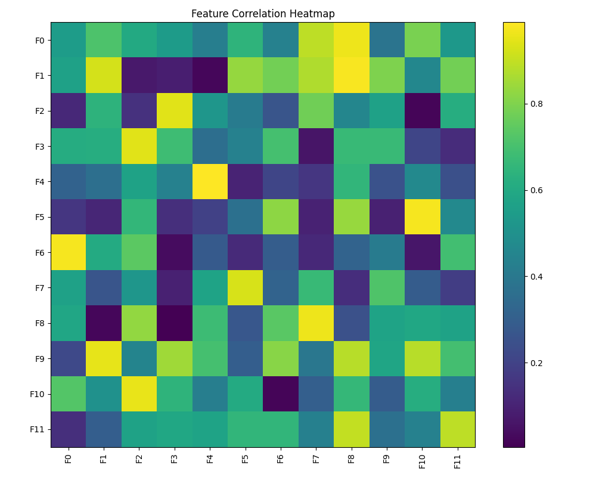
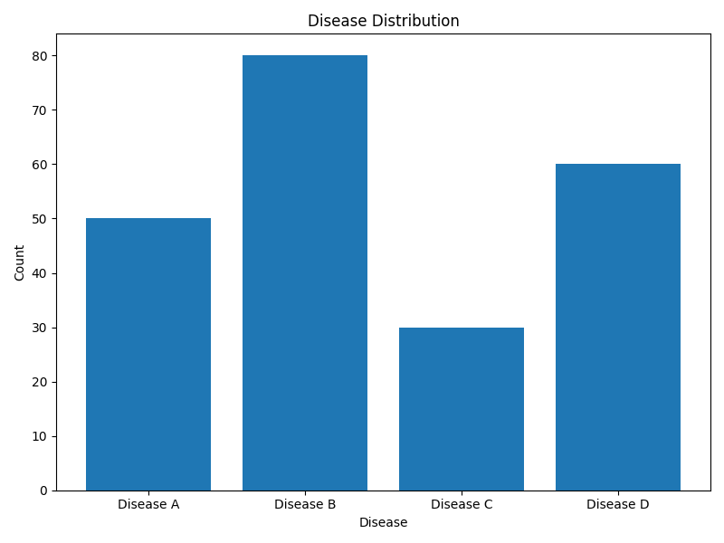

# CodeAlpha_DiseasePrediction
# 🩺 Disease Prediction from Medical Data  


---

## 📌 Project Overview  
This project focuses on predicting diseases using machine learning algorithms based on patient medical data such as symptoms, age, and test results.  

It also includes an interactive Streamlit web application that allows users to input patient data and get real-time predictions.

---

## 🎯 Objective  
To build a system that can:
- Predict diseases accurately  
- Compare multiple ML models  
- Provide an easy-to-use healthcare prediction interface  

---

## 🧠 Algorithms Used  
- Logistic Regression  
- Support Vector Machine (SVM)  
- Random Forest  
- XGBoost  

---

## 📊 Exploratory Data Analysis  

### 🔥 Correlation Heatmap  


### 📈 Disease Distribution  


---

## 🏗️ Project Structure  
Disease-Prediction/
│── training_data.csv
│── test_data.csv
│── app.py
│── model.py
│── README.md
│── images/


---

## ⚙️ Tech Stack  
- Python  
- Pandas, NumPy  
- Matplotlib, Seaborn  
- Scikit-learn, XGBoost  
- Streamlit  

---

## 🔄 Workflow  

```mermaid
graph TD
A[Data Collection] --> B[Data Preprocessing]
B --> C[EDA]
C --> D[Model Training]
D --> E[Model Evaluation]
E --> F[Best Model Selection]
F --> G[Streamlit Deployment]

📈 Model Performance
| Model               | Performance |
| ------------------- | ----------- |
| Logistic Regression | Good        |
| SVM                 | Good        |
| Random Forest       | ⭐ Best      |
| XGBoost             | High        |

🖥️ Streamlit App Preview

🚀 How to Run
Install Dependencies
pip install pandas numpy matplotlib seaborn scikit-learn xgboost streamlit
Run Model
python your_script.py
Run Web App
streamlit run app.py

🌐 Deployment

You can deploy using:

Streamlit Cloud
Render
Ngrok / Cloudflare Tunnel
✨ Features

✔ Multiple ML models comparison
✔ Data visualization
✔ Real-time prediction
✔ User-friendly interface
✔ Health insights

🔗 Submission Requirements Completed

✔ LinkedIn Post
✔ GitHub Repository
✔ Model Implementation
✔ Evaluation Metrics (Precision, Recall, F1-score, ROC-AUC)

👨‍💻 Author

Swadip Santra
CodeAlpha Machine Learning Intern

📜 License

This project is developed for educational purposes under the CodeAlpha Machine Learning Internship Program.
